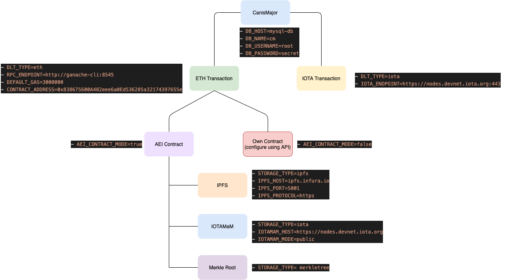

# Step-by-Step Tutorials[](https://www.fiware.org/)
[](https://opensource.org/licenses/MIT)
[](https://stackoverflow.com/questions/tagged/fiware)


### Canis Major Configuration Overview


### Docker clean up command
```sh
// stop all container
docker stop $(docker ps -a -q)
// remove all container
docker rm $(docker ps -a -q)
// delete all volumes
docker volume prune
// delete all networks
docker network prune
// delete all images
docker rmi $(docker images -a -q)
```

### Ethereum Transaction using AEI Contract
[AEI Contract](https://github.com/FIWARE-Blockchain/AEIContract) is written in Solidity using ERC721 standard (NFT) and can be use with Ethereum Clients. It is compatible with FIWARE-Canis Major Adaptor to store the data in blockchain. AEI, asset, events (metadata), relationship, is designed to store the NGSI-LD model with the help of Canis Major Adaptor.

* #### Storage Type: [IOTAMaM](https://blog.iota.org/introducing-masked-authenticated-messaging-e55c1822d50e/) (Masked Authenticated Messaging)
(make sure you remote previous docker contrainers, use the docker commands mentioned above)

#####  Step 1: Build and run the aei-contract and rpc network 
(you can use ganache-cli, besu, parity or any other client)

```sh
docker-compose -f eth-aei.yml up --build
```
once the service start it will deploy the contracts. Get the contract address from the terminal to use in step 2.

#####   Step 2: Running the Services 
(mention the contract address)

```sh
CONTRACT_ADDRESS=${CONTRACT_ADDRESS} docker-compose -f eth-aei-iotaMaM-service.yml up --build
```


* #### Storage Type: [IPFS](https://ipfs.io/) (InterPlanetary File System)
(make sure you remote previous docker contrainers, use the docker commands mentioned above)

(coming soon)

* #### Storage Type: [MerkleTree](https://ipfs.io/) (InterPlanetary File System)
(coming soon)

### IOTA Transaction
```sh
docker-compose -f iota.yml up --build
```

© 2021 FIWARE Foundation e.V.